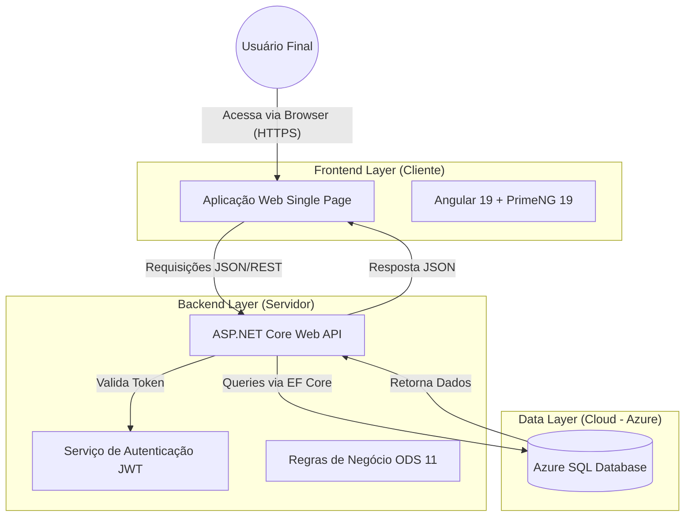

# Arquitetura do Sistema - Eco Oportunidades

## 1. Visão Geral

O **Eco Oportunidades** foi projetado utilizando uma arquitetura moderna baseada em **Microsserviços Simplificados** (neste estágio inicial, operando como um Monólito Modular), onde o Frontend e o Backend são aplicações desacopladas que se comunicam via protocolo HTTP/REST.

* **Frontend:** Hospedado estaticamente no **GitHub Pages**, garantindo acesso rápido e global.
* **Backend & Dados:** Infraestrutura de API e Banco de Dados hospedada na nuvem (**Microsoft Azure**).
  
A infraestrutura de dados foi hospedada na nuvem (**Microsoft Azure**), garantindo alta disponibilidade e simulando um ambiente real de produção corporativa.

## 2. Diagrama da Arquitetura

Abaixo, o fluxo de comunicação entre os componentes do sistema.

## 3. Stack Tecnológica Detalhada

### 3.1 Frontend (Camada de Apresentação)

Responsável pela interação com o usuário, focado na experiência (UX) e responsividade.

Framework: Angular 19.

Biblioteca de UI: PrimeNG 19.

Estilização: PrimeFlex + SCSS para layout responsivo e design system.

Comunicação: HttpClient do Angular para consumo da API REST.

### 3.2 Backend (Camada de Aplicação)

Responsável pela lógica de negócio, segurança e processamento de dados.

Framework: .NET 8.0 (LTS - Long Term Support).

Tipo de Projeto: ASP.NET Core Web API.

Linguagem: C#.

ORM: Entity Framework Core (Code First approach).

Autenticação: System.IdentityModel.Tokens.Jwt para geração e validação de tokens seguros.

Documentação: Swagger/OpenAPI integrado nativamente.

### 3.3 Banco de Dados

Hospedado em nuvem para garantir escalabilidade e acesso remoto.

SGBD: SQL Server (Azure SQL Database).

Infraestrutura: Microsoft Azure (Plano for Students).

Gerenciamento: Migrations automáticas via EF Core CLI.

## 4. Fluxo de Dados (Exemplo: Cadastro de Vaga)

Frontend: O usuário preenche o formulário no Angular (validado pelo Reactive Forms).

Envio: O Angular envia um POST para /api/vagas com o JSON da vaga.

Backend: O Controller recebe, valida o Token JWT (Autorização) e valida o modelo (Data Annotations).

Persistência: O EF Core converte o objeto C# em comando SQL INSERT.

Azure: O comando é executado no servidor Azure SQL.

Retorno: A API devolve um status 201 Created e o Frontend exibe um Toast de sucesso via PrimeNG.
